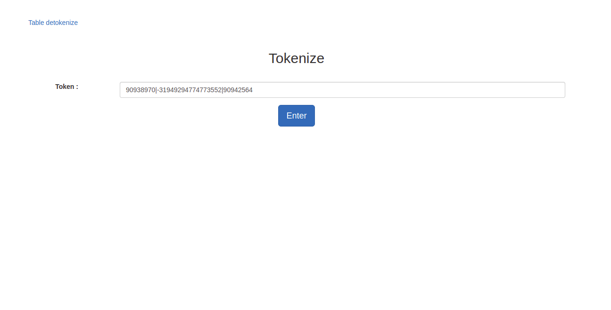

# json-data-dashboard

#  Info Sections: 

Title of the Project :JSON DATA DASHBOARD  

Brief Description of the project: This eases the use of data addition ,modification etc to JsonPowerDB. 

Demo Video (Recorded in the previous Activity): <video  width="420" height="240" > <source src="jsondatadashboard.mp4" type="video/mp4"></video>                                                                  

Important Links: 

Home page: https://login2explore.com 
Register to use JsonPowerDB: http://api.login2explore.com 
JsonPowerDB Help: https://login2explore.com/jpdb/docs.html 

Additional you can have: 

Table of contents:  home,tables pages. 

Scope of functionalities: this need a small change to be used just in table section if not it can be used to fully control api.     

Project status: mostly completed 

Sources 

Other information

</img>
